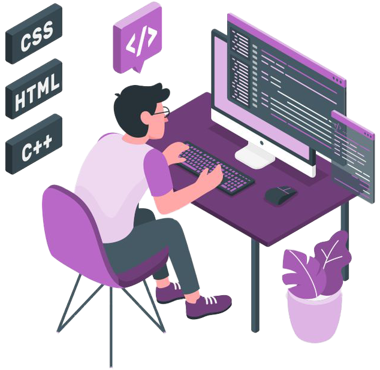

<!-- [](https://git.io/typing-svg) -->
## Hi 
<hr />

## About me

<!-- - 💻 **MERN** stack dev

- 🔎 Exploring **AI and web3**

- 🌱 Learning **Solana and Rust**

- 📫 How to reach me: email\[dot\]johnsebastian\[at\]gmail\[dot\]com

- 🎓 **Electronics and Instrumentation Engineering student** at BITS Goa

- 😄 Pronouns: **He/Him**

- 💬 Ask me anything about 🎥 and 🏀. -->

<!-- -   ⚡ Fun fact  -->


```javascript
<div class="About Me"></div>

const john = {
	occupation: "full stack dev",
	exploring: [
		"AI", "web3", "Solana", "Rust"
	],
	education: {
		highSchool: "Loyola School",
		college: "BITS Goa | Electronics and Instrumentation Engineering",
	},
	interests: [
		"film", "basketball"
	],
	contact: "email\[dot\]johnsebastian\[at\]gmail\[dot\]com",
}
```
<!-- <a href="https://github.com/jxhnsebastian"></a> -->

## Connect with me

[](https://www.linkedin.com/in/john-sebastian-839056237/)
[](mailto:email.johnsebastian@gmail.com)
[](https://github.com/jxhnsebastian)
<br />

##  Technologies and Tools
<p align="left"> 
	  
	   
	  
	  
	  
	  
	  
	  
	  
	  
	  
	  
	  
</p>  
<br />
  
## Github Stats

<details>
  <summary>📊 GitHub Profile Stats</summary>
  <br/>
  <a href="https://github.com/anuraghazra/github-readme-stats"></a>
</details>

<details> 
  <summary>💻 Most used languages</summary>
  <br/>
  <a href="https://github.com/anuraghazra/github-readme-stats"></a>
  <br/>
  <b>Note:</b> This chart is only a metric of which languages my public code on GitHub consists of and does not reflect my experience or skill level.
</details>

<details>
  <summary>⚡GitHub Streak</summary>
  <br/>
  <a href="https://github.com/DenverCoder1/github-readme-streak-stats"></a>
</details>

<details>
  <summary>📈GitHub Activity</summary>
  <br/>
  <a href="https://github.com/ashutosh00710/github-readme-activity-graph"></a>
</details>
<br />

Bye


<!--
**jxhnsebastian/jxhnsebastian** is a ✨ _special_ ✨ repository because its `README.md` (this file) appears on your GitHub profile.

Here are some ideas to get you started:

- 🔭 I’m currently working on ...
- 🌱 I’m currently learning ...
- 👯 I’m looking to collaborate on ...
- 🤔 I’m looking for help with ...
- 💬 Ask me about ...
- 📫 How to reach me: ...
- 😄 Pronouns: ...
- ⚡ Fun fact: ...
-->
